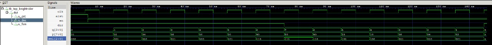
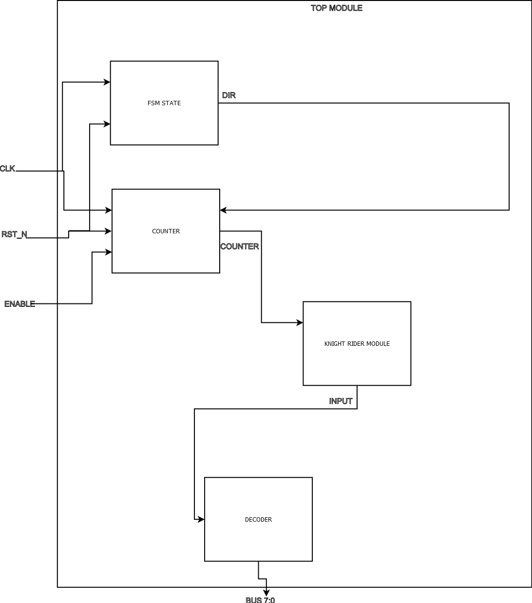

# **1st Assignment — Knight Rider Sequence Controller**



---

## **Design specifications**

Develop a Verilog project composed of four interconnected modules, each verified by its own testbench, to create a **Knight Rider–style LED sequence**.  
The system generates a moving one-hot LED pattern that bounces between the left and right ends of an 8-LED array.

### **Required modules**

1. **`decoder.v`** — 3-bit combinational decoder (demultiplexer, one-hot output).
2. **`counter.v`** — 4-bit up/down counter with asynchronous reset and count-enable input.
3. **`fsm_dir.v`** — Two-state finite state machine controlling the direction of counting (up or down).
4. **`top.v`** — Structural top-level module connecting all three submodules to implement the moving LED sequence.

The 2-state FSM changes the direction when the counter reaches the boundaries (`0` and `7`), while the decoder activates one LED corresponding to the counter position.

---

## **System overview**

The design simulates the iconic **Knight Rider light pattern**, where a single LED "moves" from left to right and back, repeatedly.  
The counter defines the LED position, and the FSM toggles the direction at the limits.

### **Functional flow**

FSM_dir ───► Counter (Up/Down) ───► Decoder (3→8 one-hot) ───► LED Output

- **FSM_dir:** toggles between UP and DOWN states.
- **Counter:** increments or decrements according to FSM output.
- **Decoder:** drives the 8 LEDs with a single high bit.
- **Top:** integrates all modules and can include a clock divider for visualization.

---

## **Block diagram**



---

## **Project delivered under `devEnv/work/1stAssignment/`**

- **Reference documentation:** [`Reference documentation`](ReferenceDocumentation.pdf)
- **Results:** [`results DIR `](results/) (`.vcd`, `.png`, `.jpg`)
- **Sources:** [`sources DIR`](src/) (`*.v`)
- **Testbenches:** [`Testbenches DIR`](tb/) (`*.v`)
- **Makefile:** [`Makefile`](Makefile)
- **Docs:** [`docs DIR/`](docs/)

  - Design and test plan → [`Design RULES `](docs/design/DESIGNRules.md)
  - Block diagram (Graphviz) →[`borrow block diagrams `](docs/blockDiagram/block_diagram.png) (`*.svg, png, dot`)
  - Block diagram →[`borrow block diagrams `](docs/blockDiagram/blockBase.jpg)
  - AI usage notes → [`AI usage `](docs/ai/AI_USAGE.md)

---

## **How to run tests**

**Requirements:**  
`iverilog` and `vvp` must be installed and available in PATH.

**Run from project root:**

```bash
cd work/1stTask/
make test


```

Manual example:

```bash

iverilog -g2012 -o build/tb_top.vvp src/\*.v tb/tb_top.v
vvp build/tb_top.vvp
gtkwave results/tb_top.vcd
```

## Verification strategy:

Each module was tested independently:

| Module      | Testbench      | Purpose                                                           |
| :---------- | :------------- | :---------------------------------------------------------------- |
| `decoder.v` | `tb_decoder.v` | Validate one-hot output for all 3-bit input combinations.         |
| `counter.v` | `tb_counter.v` | Verify up/down counting, asynchronous reset, and enable signal.   |
| `fsm_dir.v` | `tb_fsm_dir.v` | Confirm correct state transition between UP and DOWN.             |
| `top.v`     | `tb_top.v`     | Validate integrated LED sequence movement and direction reversal. |

## Design notes :

- The Knight Rider effect is achieved by shifting a one-hot bit across the LED array and reversing direction at each end.

- The FSM_dir ensures correct direction changes.

- The counter includes asynchronous reset and enable logic for testability.

- The decoder transforms the counter’s 3-bit position into one-hot LED control signals.

- A clock divider can be added to slow the sequence for visible hardware output on an FPGA board.

## Simulation summary

- The waveform confirms sequential LED activation and correct bouncing at boundaries.

- FSM transitions and counter enable signals operate in phase.

- The system passes all modular and integrated testbenches.

### All modules perform as intended, demonstrating a functional and verified Knight Rider LED sequence implemented with FSM control, counter logic, and combinational decoding.
