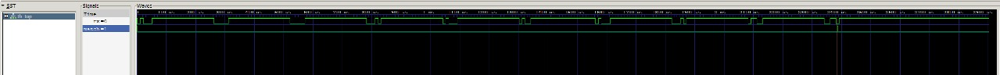
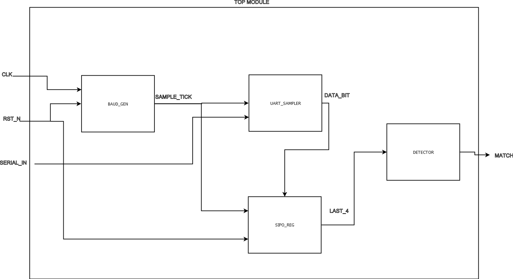

# 2cnd assignment DIR



## desing specifications

Develop a Verilog project composed of four functional modules, each verified by an individual testbench, and a top module integrating the system.

The purpose of this assignment is to design, simulate, and verify a UART-based pattern detector, where the detected pattern corresponds to the last digit of the student ID (ID_LAST_DIGIT = 6 → 0110).

---

# design :

## System overview

The full system receives serial UART data at a defined baud rate and generates a pulse (match = 1) whenever the last four received bits equal the binary pattern 0110.

### Modules required

1. baud_gen.v — Frequency divider that produces a baud-rate tick (tick) from the system clock.

2. uart_sampler.v — Detects UART start bits, aligns the baud generator, and samples each bit in the middle of its period.

3. sipo_reg.v — Serial-In Parallel-Out shift register that stores the last 8 received bits.

4. detector.v — Combinational comparator that asserts match when window[3:0] == pattern[3:0].

5. top.v — Integrates all modules into a functional receiver that detects the specified bit pattern.

Each module includes a dedicated testbench verifying its behavior separately before full-system integration.

## block diagram



## Project delivered under `devEnv/work/2cndAssignment/`:

- **basis REFERENCE DOCUMENTATION ** → [`REFERENCE DOC `](2cndAssignmentReferenceDoc.pdf)

- **build ** → [`build DIR `](build/) .vpp files
- **results ** → [`results DIR `](results/) .jpg and .vcd GTKwave files
- **sources ** → [`sources DIR `](src/) .v modules
- **Testbenches ** → [`Testbenches DIR `](tb/) .v modules
- Makefile: `work/2cndAssignment/Makefile`
- **makefile ** → [`MAKEFILE`](Makefile) for automatization

- **Docs ** → [`Docs DIR `](docs/) reference documentation

  - **Block diagram ** → [`block diagram`](docs/blockDiagram.png)
  - **AI usage notes ** → [`AI USAGE .MD `](docs/AI_USAGE.md)

## How to run tests:

- Prereqs: `iverilog` and `vvp` in PATH.
- From `work/2cndAssignment/`: run `make test`.

Alternatively, manual run example:

```
iverilog -g2012 -o build/tb_top.vvp src/*.v tb/tb_top.v
vvp build/tb_top.vvp
gtkwave results/tb_top.vcd
```

## Simulation cases :

Case 1 — No match

    - Sent byte 0xFF → no occurrence of pattern 0110.

match remains low.

Case 2 — Consecutive matches

    - Sent byte 0x66 (0110 0110) → two match pulses detected.

Case 3 — Pattern only at the end

    - Transmitted full ID "1004191436" as ASCII bytes (0x31 0x30 … 0x36).

    - Only the final byte ('6' = 0x36 = 0011 0110) triggered match = 1.

System correctly identifies the last digit of the ID.

## Notes :

- The complete receiver chain (baud_gen → uart_sampler → sipo_reg → detector) correctly implements real UART behavior.
- The design was validated through Icarus Verilog + GTKWave, ensuring clean timing and single-cycle match pulses.

- For FPGA demonstration, match can be mapped to a LED or output pin.

- Clock divider or slow baud rate may be added for visual hardware display.
