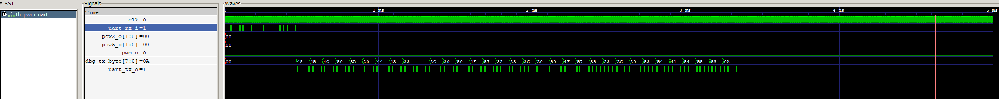

# 3rd assignment - PWM controlled via UART



## desing specifications

Develop a Verilog project composed of several functional modules, each verified by an individual testbench, and a top module integrating the system.

The purpose of this assignment is to design, simulate, and verify a PWM generator controlled via UART, where the user sends ASCII command strings (HELP, STATUS, DC##, POW2#, POW5#) through serial communication at 115200 baud. The system processes these commands, updates internal registers, and drives a PWM output whose frequency and duty cycle can be modified in real time.

---

# design :

## System overview

The full system receives serial UART data at 115200 baud, stores incoming characters in a FIFO, and parses text-based commands to update internal PWM configuration registers.

- The parameters:

duty → duty cycle (0–99%)

pow2 → 2^N frequency scale

pow5 → 5^M frequency scale

determine the PWM frequency according to:

PWM_freq = 50 kHz / ( 2^pow2 · 5^pow5 )

- The command interface supports:

HELP\n → prints list of valid commands

STATUS\n → prints duty, pow2, pow5, and resulting frequency

DC##\n → updates duty (00–99)

POW2#\n → sets pow2

POW5#\n → sets pow5

invalid strings → return FAIL

### Modules required

1. uart_rx.v — UART receiver that generates rx_valid and rx_byte for each received byte.

2. rx_fifo.v — 32-byte circular FIFO for buffering incoming ASCII characters.

3. cmd_parser.v — FSM that interprets the string stored in the FIFO and generates updates to PWM registers.

4. status_regs.v — Stores valid values for duty, pow2, and pow5 (updated only on valid commands).

5. pwm_clk_gen.v — Produces the PWM period tick applying the 2^N · 5^M divider.

6. pwm_core.v — Generates the duty-cycle-controlled PWM output using the incoming tick.

7. uart_tx.v — UART transmitter that serializes responses such as "OK", "FAIL", "STATUS", etc.

8. top_pwm_uart.v — Integrates the whole chain and connects CLK, RST_N, RX, TX, PWM_OUT.

Each module includes a dedicated testbench verifying its behavior separately before full-system integration.

## block diagram


## Project delivered under `devEnv/work/2cndAssignment/`:

- **basis REFERENCE DOCUMENTATION ** → [`REFERENCE DOC `](2cndAssignmentReferenceDoc.pdf)

- **build ** → [`build DIR `](build/) .vpp files
- **results ** → [`results DIR `](results/) .jpg and .vcd GTKwave files
- **sources ** → [`sources DIR `](rtl/src/) .v modules
- **Testbenches ** → [`Testbenches DIR `](rtl/tb/) .v modules
- **script** → [`scripts DIR `](scripts/) scrip for automatization
- **Docs ** → [`Docs DIR `](docs/) reference documentation
- **Docs ** → [`Docs DIR `](docs/) reference documentation

  - **Block diagram ** → [`block diagram`](docs/blockDiagram.png)
  - **AI usage notes ** → [`AI USAGE .MD `](docs/AI_USAGE.md)

## How to run tests:

Using Makefile (recommended) or .ps1

From work/3rdAssignment/: (IMPORTANT)

make test
or
pwsh scripts\run_sim.ps1

Alternatively, manual run example:

```


Manual example:
iverilog -g2012 -o buildTemp/tb_top.vvp \
    rtl/src/uart/uart_rx.v \
    rtl/src/uart/uart_tx.v \
    rtl/src/cmdParser/cmd_parser.v \
    rtl/src/pwm/pwm_core.v \
    rtl/src/pwm/pwm_clk_gen.v \
    rtl/src/status_regs.v \
    rtl/src/top_pwm_uart.v \
    tb/top_pwm_uart_tb.v

vvp buildTemp/tb_top.vvp
gtkwave buildTemp/gtkWaveVCDFiles/top_pwm_uart_tb.vcd
```

## test cases

### nominal commands :

```
Sent string HELP\n

UART_TX outputs a help banner listing valid commands.
```

### boundary cases (pow2/5 updates) :

```
Sent POW21\n → pow2 = 1

Sent POW50\n → pow5 = 0

Out-of-range values produce FAIL
```

### invalid inputs:

Sent XYZ\n

Parser returns FAIL

### FIFO overflow :

Send >32 bytes without \n

FIFO must discard excess data and ignore commands until a new start byte arrives.

## Notes :

- The full chain (UART_RX → FIFO → CMD_PARSER → status_regs → PWM blocks → UART_TX) correctly implements UART protocol timing and command-based control.

- The design was validated using Icarus Verilog + GTKWave, verifying correct command parsing and PWM generation.

- For FPGA demonstration, PWM_OUT can be visualized on a pin or LED, and TX responses can be read through a USB-UART terminal.
