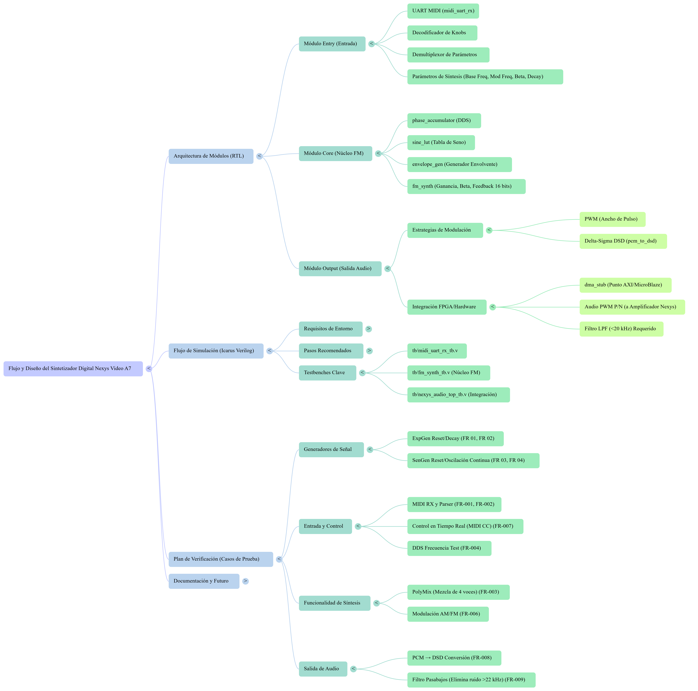
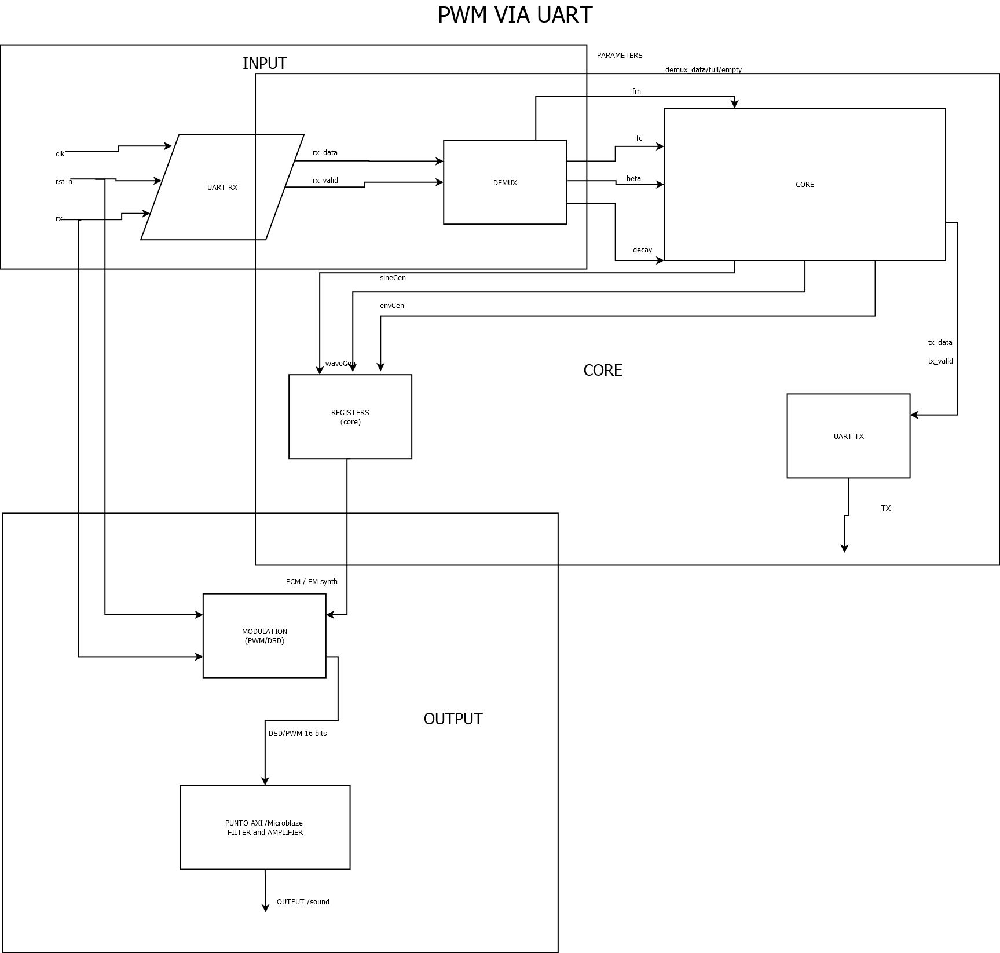

# Audio Synthesizer on FPGA – UART-Controlled


## Design specifications

Develop a Verilog/SystemVerilog project composed of several functional modules, each one verified by an individual testbench, and a top-level module that integrates the complete audio synthesizer.

The goal of this assignment is to design, simulate, verify, and integrate a digital audio synthesizer in FPGA. The user configures and plays notes through a UART command interface (115200 baud). The system decodes the incoming commands, updates internal registers (waveform, pitch, envelope, gain, etc.) and generates a real-time audio output (PWM or 1-bit DAC) suitable for low-pass filtering and listening on a speaker or audio output stage.

---

# Design

## System overview

The complete system receives serial data over UART at 115200 baud, stores incoming characters in a FIFO, and parses text-based commands to update the internal configuration registers of the synthesizer. These registers control the oscillators, envelopes and global mixer, which together generate the final audio signal.

### Main parameters (example basis (UPDATE))

- `note` → MIDI note number or direct frequency code
- `wave` → waveform type (SINE, SQR, SAW, TRI, NOISE, etc.)
- `env_a`, `env_d`, `env_s`, `env_r` → ADSR envelope parameters
- `gain` → master volume / output amplitude control
- `voice_sel` → selects active voice or global mode (for multi-voice designs)

The audio sample rate and internal phase increments determine the pitch of each note. A typical relationship is:

- `f_out = (phase_inc / 2^N) · f_clk_audio`

where:

- `f_out` is the oscillator output frequency
- `phase_inc` is configured by the command interface
- `2^N` is the phase accumulator resolution
- `f_clk_audio` is the audio processing clock

### Command interface (example)

The UART command interface supports ASCII command strings terminated by `\n`. Some typical commands might be:

- `HELP\n` → prints list of valid commands and usage
- `STATUS\n` → prints current synth status (wave, note, gain, env parameters…)
- `NOTE###\n` → sets current note / pitch (e.g. MIDI number 000–127 or custom range)
- `WAVE X\n` → selects waveform (e.g. `WAVE S`, `WAVE Q`, `WAVE T`, `WAVE N`)
- `GAIN##\n` → sets master gain (00–99 %)
- `ENV A# D# S# R#\n` → configures ADSR envelope parameters
- `VOICE#\n` → selects or enables a particular voice (if multi-voice)
- Invalid strings → response `FAIL\n` (or some error banner)

(Names and exact formats can be adapted to match the implemented parser; this README assumes the same ASCII-based CLI idea as previous assignments.)

### Main modules

1. `uart_rx.v`  
   UART receiver; generates `rx_valid` and `rx_byte` for each received byte.

2. `rx_fifo.v`  
   FIFO buffer (e.g. 32-byte circular buffer) for incoming ASCII command characters; decouples UART reception from command parsing.

3. `cmd_parser.v`  
   FSM that reads characters from the FIFO, decodes complete command strings and produces register-update strobes for synthesizer configuration (note, wave, gain, ADSR, etc.).

4. `synth_regs.v` (status/config registers)  
   Stores the current configuration of the synthesizer (note, waveform, ADSR, gain, voice selection). Registers are only updated for valid commands; invalid ones leave the current configuration unchanged.

5. `osc_core.v`  
   Phase accumulator and waveform generator. Implements:

   - Phase increment computation from `note` (or direct freq code)
   - Waveform ROM / LUT or algorithmic waveform generation (SINE, SQR, SAW, TRI, etc.)
   - Optional multi-voice support (one instance per voice or time-multiplexed).

6. `env_gen.v`  
   ADSR envelope generator. Generates a time-varying amplitude envelope in response to “note on/off” style events from the command parser or internal note trigger.

7. `mixer.v`  
   Combines one or more oscillator outputs, applies envelopes and global gain, and generates a single mixed audio sample stream.

8. `audio_dac.v` (PWM / 1-bit DAC or simple DAC interface)  
   Converts the mixed audio samples to a 1-bit high-frequency audio stream (PWM or delta-sigma style) or to a parallel DAC interface, depending on the target board. This is the signal that will be low-pass filtered and sent to the speaker.

9. `uart_tx.v`  
   UART transmitter; serializes textual responses such as `OK\n`, `FAIL\n`, `STATUS\n`, or debug/trace messages.

10. `top_synth_uart.v` (top-level)  
    Integrates the complete chain and connects:
    - `CLK`, `RST_N`
    - `RX` (UART input) and `TX` (UART output)
    - `AUDIO_OUT` (PWM / DAC output)
    - Optional debug IOs (LEDs, switches) for board-level demos.

Each RTL block has its own testbench to verify functionality in isolation before full-system integration.

## Block diagram

### General block diagram



### functional block diagram



(Use the updated block diagram for the audio synthesizer: UART → FIFO → CMD_PARSER → SYNTH_REGS → OSC / ENV / MIXER → AUDIO_DAC, plus UART_TX feedback path.)

---

## Project structure

Project delivered under `devEnv/work/AudioSynth/` (or equivalent assignment folder):

- **Reference documentation** → [`REFERENCE DOC`](docs/Plan%20de%20Proyecto%20FPGA%20para%20Sintetizador.pdf)  
  Specification / project description for the audio synthesizer.

- **Build artifacts** → [`build/`](build/)  
  Compiled simulation executables (`.vvp`) / synthesis output (`.bit`, `.vpp`), depending on the flow.

- **Results** → [`results/`](docs/results/)  
  Screenshots, plots and waveforms: `.jpg`, `.png`, `.vcd` (GTKWave), plus any measurement logs.

- **RTL sources** → [`rtl/src/`](src/rtl/)  
  All synthesizer RTL modules (`uart_rx`, `uart_tx`, `rx_fifo`, `cmd_parser`, `synth_regs`, `osc_core`, `env_gen`, `mixer`, `audio_dac`, `top_synth_uart`, etc.).

- **Testbenches** → [`rtl/tb/`](tb/)  
  Testbenches per module and top-level:

  - `*_tb.v` for standalone module tests
  - `top_synth_uart_tb.v` for full-chain verification.

- **Scripts** → [`scripts/`](scripts/)  
  Automation scripts (e.g. `run_sim.ps1`, shell scripts, make targets) to compile, run simulations, and optionally launch GTKWave.

- **Docs** → [`docs/`](docs/)  
  Project documentation, diagrams, and AI usage notes:
  - Updated block diagram → [`blockDiagram.png`](docs/basisBlockDiagram.png)
  - Any design notes, timing budgets, or FPGA board-specific pinout docs.

---

## How to run tests

Assuming a Makefile and the provided scripts are correctly configured.

From `work/AudioSynth/` (or the root folder of this assignment):

### Using Makefile (recommended)

```bash
make test

Typical targets:

make sim → compile and run main testbenches

make tb_osc → only oscillator core testbench

make tb_top → full top-level synthesizer test

Check the Makefile to see the available module-level targets.
```

### Manual example (icarus verilog)

```
# Example: full top-level synth testbench
iverilog -g2012 -o buildTemp/tb_top.vvp \
    rtl/src/uart/uart_rx.v \
    rtl/src/uart/uart_tx.v \
    rtl/src/fifo/rx_fifo.v \
    rtl/src/cmd_parser/cmd_parser.v \
    rtl/src/synth/synth_regs.v \
    rtl/src/synth/osc_core.v \
    rtl/src/synth/env_gen.v \
    rtl/src/synth/mixer.v \
    rtl/src/synth/audio_dac.v \
    rtl/src/top_synth_uart.v \
    rtl/tb/top_synth_uart_tb.v

vvp buildTemp/tb_top.vvp
gtkwave buildTemp/gtkWaveVCDFiles/top_synth_uart_tb.vcd


```

## notes
