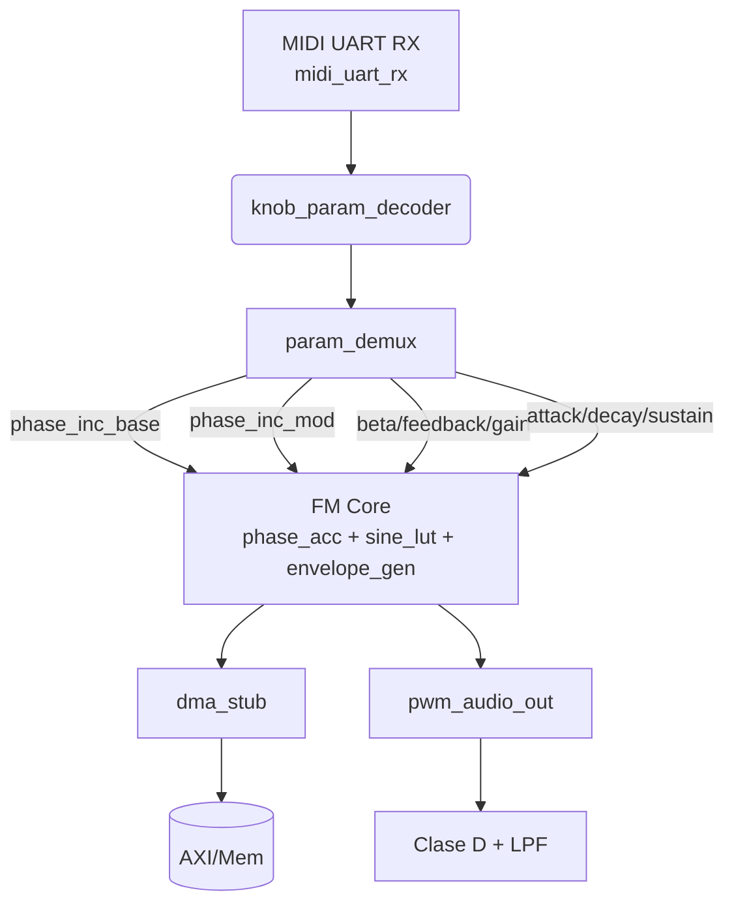

# Arquitectura propuesta

## Vision general

El proyecto se divide en tres dominios logicos alineados con el documento `designReq.md`:

1. **Entry / Control** - Captura serial MIDI (31.25 kbaud), filtra los bytes relevantes provenientes de knobs/controles y distribuye los parametros sobre registros dedicados mediante un demultiplexor.
2. **Core de sintesis** - Implementa un oscilador DDS dual (carrier/modulador), tabla senoidal con cuantizacion Q1.15, la cadena FM (beta/feedback) y un generador de envolvente exponencial sencillo (ATA/DECAY/SUSTAIN).
3. **Output / DSD** - Convierte las muestras firmadas a PWM (1 bit) compatible con el amplificador clase D de la Nexys Video A7 y expone un stub de DMA listo para reemplazarse por un AXI-DMA/MicroBlaze.

## Diagrama de bloques (alto nivel)

## Senales clave por bloque

| Bloque | Entradas principales | Salidas principales | Comentarios |
| --- | --- | --- | --- |
| `midi_uart_rx` | `clk100`, `rst`, `midi_rx` | `data_out[7:0]`, `data_valid` | Ajustar `CLK_FREQ_HZ` si se usa otro reloj. |
| `knob_param_decoder` | `midi_data`, `midi_valid` | `param_addr`, `param_value`, `param_valid` | Usa bits `[6:4]` como selector (hasta 8 parametros simultaneos). |
| `param_demux` | `param_addr/value/valid` | `phase_inc_base/mod`, `beta`, `gain`, `feedback`, `attack`, `sustain`, `decay`, `timbre_sel` | Contiene presets por defecto (432 Hz). |
| `fm_synth` | Increments + ADSR + `gate` | `sample[15:0]`, `sample_valid` | Combina `phase_accumulator`, `sine_lut`, `envelope_gen`. |
| `pwm_audio_out` | `sample[15:0]`, `clk` | `audio_pwm_p/n` | Modulacion de ancho de pulso unipolar; agregar filtro LC externo. |
| `dma_stub` | `sample`, `sample_valid` | `last_written`, `ready` | Punto de insercion para AXI-DMA + MicroBlaze. |

## Consideraciones para Nexys Video A7

- Reloj: utilice el oscilador de 100 MHz (`clk100`). Si activas el MMCM interno, actualiza `CLK_FREQ_HZ`.
- Audio out: `pwm_audio_out` produce dos senales complementarias para el amplificador clase D integrado. Anade un filtro pasabajas RC/LC con corte <20 kHz (como exige el documento original).
- MicroBlaze / AXI: `dma_stub` se dejo minimalista para que pueda reemplazarse por un bloque AXI-Stream conectado a un MicroBlaze (C/SDK) que configure registros via AXI-Lite o UART externo.

### Variante DSD por PMOD

- `pcm_to_dsd` convierte `pcm_sample` de 24 bits a DSD 1 bit a ~3.125 MHz (OSR=64) usando Delta-Sigma de segundo orden.
- Pin sugerido: PMOD JA1 (H17) como `dsd_bit` single-ended; filtrar con RC (6.8k + 1 nF aprox. fc 23 kHz) antes del bafle autoamplificado.
- Para usar el seno del zCode, conecta `pcm_ready` a la fuente PCM y manten `pcm_valid` alto cuando la muestra este estable. Con `fm_synth`, extiende a 24 bits: `{synth_sample, 8'd0}`.

## Integracion futura

1. Sustituir `dma_stub` por un DMA real con acceso a DDR/BRAM usando Vivado IP Integrator.
2. Anadir una LUT exponencial real (o CORDIC) si se requiere la forma envolvente descrita (`e^{-t/t}`) en hardware.
3. Implementar un bloque de interpolacion en `sine_lut` (o ampliar la profundidad a 1024 muestras) para reducir distorsion al reproducir 500 canales virtuales.
4. Conectar los botones/knobs fisicos de la Nexys via interfaz PMOD o el MIDI-USB de un MicroBlaze auxiliar como describe el requisito original.
